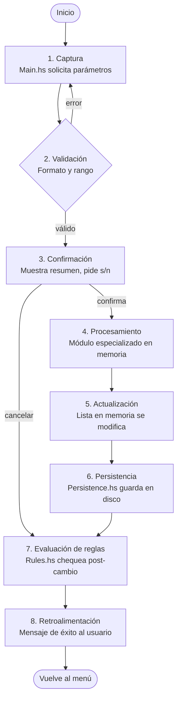

# FinancesManagement

El Sistema de Gestión de Finanzas Personales es una aplicación de consola desarrollada en Haskell que permite a los usuarios administrar, analizar y proyectar sus finanzas personales de manera integral. El sistema funciona como una herramienta monousuario que mantiene un registro detallado de ingresos, gastos, ahorros e inversiones.

---

## Integrantes

- Christopher Daniel Vargas Villalta, 2024108443
- Andrey Jesús Jiménez Núñez,  2024145153
- Isaac Villalobos Bonilla, 2024124285
- Daniel Arce Campos, 2024174489

**IC 4700: Lenguajes de Programacion**
Prof. Bryan Tomas Hernandez Sibaja

---

## Requisitos

- [Stack](https://docs.haskellstack.org/en/stable/) — gestor de proyectos Haskell (maneja GHC y dependencias automáticamente)
- [Visual Studio Code](https://code.visualstudio.com/) con la extensión **Haskell** (`haskell.haskell`)

> Stack es el único requisito obligatorio para compilar y ejecutar. La extensión de VS Code es opcional pero recomendada para desarrollo.

---

## Instalación de Stack

### Windows
1. Descargar el instalador desde https://docs.haskellstack.org/en/stable/
2. Ejecutar el instalador y seguir los pasos
3. Abrir una terminal nueva y verificar con:
```
stack --version
```

### Linux / macOS
```bash
curl -sSL https://get.haskellstack.org/ | sh
```

---

## Cómo correr el proyecto

```bash
# 1. Clonar el repositorio
git clone <url-del-repositorio>
cd FinancesManagement

# 2. Compilar (la primera vez descarga GHC automáticamente, puede tardar unos minutos)
stack build

# 3. Ejecutar
stack exec FinancesManagement
```

> Las siguientes veces que se compile, `stack build` es inmediato porque GHC y las dependencias ya están en caché.

---

## Estructura del proyecto

```
FinancesManagement/
├── stack.yaml                  # Versión del ecosistema Haskell (resolver/GHC)
├── FinancesManagement.cabal    # Descriptor del proyecto y dependencias
├── README.md                   # Documentación principal
├── ARQUITECTURA_LOGICA.md      # Documentación de arquitectura lógica (generada)
├── app/
│   └── Main.hs                 # Menú interactivo (punto de entrada)
└── src/
    ├── Types.hs                # Tipos de datos (RecordType, FinancialRecord)
    ├── Records.hs              # Lógica de registros (agregar, filtrar, ordenar)
    ├── Display.hs              # Presentación en consola
    ├── Persistence.hs          # Lectura/Escritura de archivos
    ├── Rules.hs                # Reglas y alertas
    ├── Budgets.hs              # Gestión de presupuestos
    ├── Analysis.hs             # Análisis y proyecciones
    ├── Simulation.hs           # Simulaciones y escenarios
    └── Reports.hs              # Generación de reportes
```

---

## Flujo de Trabajo

1. INICIO: Usuario ingresa comando en menú
2. APTURA: Main.hs solicita parámetros
3. VALIDACIÓN: Verifica formato y rango de valores
4. CONFIRMACIÓN: Muestra resumen y pide confirmación
5. PROCESAMIENTO: Módulo especializado procesa en memoria
6. ACTUALIZACIÓN: La lista en memoria se modifica
7. PERSISTENCIA: Persistence.hs guarda cambios a disco
8. EVALUACIÓN DE REGLAS: Rules.hs chequea reglas post-cambio
9. RETROALIMENTACIÓN: Mensaje de éxito al usuario
10. FIN: Vuelve al menú principal




---

## Arquitectura

El sistema sigue una arquitectura modular y monolítica orientada a consola: Main orquesta la interacción con el usuario y delega responsabilidades a módulos especializados (Types, Records, Persistence, Budgets, Analysis, Simulation, Reports, Rules, Display). Al iniciar la aplicación, los archivos serializados (p. ej. registros.dat, presupuestos.dat, reglas.dat) se cargan completamente en memoria en una estructura RecordStore; todas las consultas, filtros y cálculos (resúmenes mensuales, comparaciones, proyecciones) se realizan sobre esa colección en memoria y, cuando el usuario modifica datos, la lista actualizada se vuelve a serializar y escribir en disco. El proyecto se construye y ejecuta con Stack, que gestiona la versión de GHC y dependencias, manteniendo reproducibilidad y facilidad de compilación.

El flujo de datos es sencillo y determinista: entrada interactiva → validación en Main → procesamiento en el módulo correspondiente → actualización en memoria → persistencia por Persistence → retroalimentación al usuario. Las proyecciones y simulaciones (por ejemplo, la proyección de ahorros) calculan un ahorro mensual derivado de aplicar porcentajes de reducción a los gastos actuales y generan una suma acumulada mes a mes a partir del último mes con datos reales. Esta arquitectura nos aporta mucho en seguridad de tipos, modularidad y simplicidad de despliegue.

---

## Manual de Usuario

Link del manual de usuario: https://docs.google.com/document/d/1rAzjif-6z02T0bY1jq8WedCgVM4M9fEMBX42-46sYDU/edit?usp=sharing


